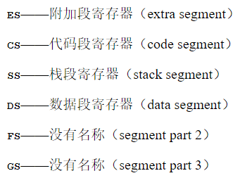

# 目录
- [目录](#目录)
  - [文件结构及相关说明](#文件结构及相关说明)
  - [Day01](#day01)
  - [Day02](#day02)
  - [Day03](#day03)
  - [Day04](#day04)
  - [Day05](#day05)
  - [Day06](#day06)
  - [Day07](#day07)

## 文件结构及相关说明

1. src      -- 源码
2. img     -- 资料图片
3. tools    -- 使用的工具
   * bz1621   -- 十六进制编辑器(二进制编辑器)
   * MyOSHead -- 自己的操作系统需要的头文件(由作者提供，里面记录了主函数入口的等相关信息)
   * <a href = "./tools/nask.exe">nask.exe</a> -- 汇编转镜像的程序
   * <a href = "./tools/eding.exe">eding.exe</a>    -- 合并两个映像文件的工具
   * <a href = "/toosl/fdimd0at.tek">fdimd0at.tek</a> -- <a href = "./tools/edimg.exe">edimg.exe</a> 的辅助程序，代表空白软盘
   * <a href = "./tools/cc1.exe">cc1.exe</a>     -- c语言转汇编的程序，由gcc改造而来
   * <a href = "./tools/gas2nask.exe">gas2nask.exe</a> --将gas汇编转化为nask汇编，以便自己的操作系统可以读取
   * <a href = "./tools/obj2bim.exe">obj2bim.exe</a>  --链接器, 把<a href = "./tools/nask.exe">nask.exe</a> 产生的未链接的文件链接起来
   * <a href = "./tools/makefont.exe">makefont.exe</a> --将hankaku字模转化成 **.bin** 后缀文件的工具
   * <a href = "./tools/bin2obj.exe">bin2obj.exe</a> --将<a href = "./tools/makefont.exe">makefont.exe</a>产出的 **.bin** 后缀文件转化成.obj文件的工具
   * MyTools:
     * <a href = "./tools/hankaku2hex.exe">hankaku2hex.exe</a> --将作者提供的hankaku字模转化成16进制

## Day01

1. 使用汇编编写了磁盘的格式
2. 汇编命令
   * **DB**: “define byte”的缩写，也就是往文件里直接写入1个字节的指令
   * **DW**: "define world"的缩写，也就是往文件里直接写入2个字节的指令
   * **DD**: "define double-world"的缩写，也就是往文件里直接写入4个字节的指令
   * **RESB**: 预留空间
   * **IN**:读取端口信息的命令
   * **OUT**: 写入端口信息的命令
   * **CLI**: clear interupt的缩写, 意为禁止中断
   * **STI**: set interupt的缩写, 意为开启中断
   * **IRETD** : 中断程序执行完毕后返回原程序的指令

3. 寄存器
   * <br><center>8位寄存器</center>
      
   * <br><center>16位寄存器</center>
      
   * <br><center>段位寄存器</center>
      

## Day02

1. 使用汇编输出了hello zzq, I am your OS. (*^_^*)

## Day03

1. 制作IPL(**启动程序加载器**也叫**引导加载程序**)加载启动扇区到内存(起始位置0x8200)

   * BIOS在启动时会自动读取第一个扇区到内存，这个扇区中记录了磁盘和操作系统相关的信息，并由此引导系统进入操作系统，也因此IPL.asm对应的是位于软盘正面的第一个扇区(512字节)的程序, 即C0-H0-S1上的程序
   * 1张软盘有80个柱面，2个磁头，18个扇区，且一个扇区有512字节。所以，一张软盘的容量是：80×2×18×512 = 1 474 560 Byte = 1 440KB
   * IPL.asm读取了正反两面磁盘的2-18扇区(反面是0-18)的0-9柱面(总共 2 * 10 * 18 * 512 = 184320 字节)到0x80000处
   * 内存中程序的分布情况见下图
       <br><center>内存分布图 </center>
2. 正式开始制作操作系统

   * 编写MyOS.asm 为操作系统源码, 生成MyOS.sys文件
   * MyOS.asm对应的是IPL.asm要读取的内容, FAT12格式中0x00260后开始放文件名，0x00420后开始放文件对应的具体内容, 所以MyOS.asm对应的程序被读取到了内存的0x8000+0x4200=0xc200处
   * 使用 <a href = "./tools/edimg.exe">edimg.exe</a>(用法见makefile)合并MyOS.sys和IPL.img 生成MyOS.img
   * MyOS.img 就是最终的整个软盘
3. 导入C语言

   * 编写bootpack.c文件(里面放置操作系统的入口函数**OSMain**)
   * 使用<a href = "./tools/cc1.exe">cc1.exe</a>编译后，使用gas2nas转化成nas汇编。cc1.exe是作者提供的C语言编译器,据说由gcc改造而成，产生gas汇编
   * 用<a href = "./tools/naks.exe">naks.exe</a> 产生相应的映像文件(未链接)，然后使用<a href = "./tools/obj2bim.exe">obj2bim.exe</a>以及<a href = "./tools/bim2hrb.exe">bim2hrb.exe</a>产生链接文件
   * 最后使用windows cmd自带的 **copy /B** 命令合并产生的链接文件与原本操作系统对应的汇编文件(注意使用copy /B的时候要把操作系统的汇编文件**放在加号的前面**)
4. 使用汇编编写C语言函数

   * 使用汇编编写的函数函数名前要加一个下划线(比如C语言声明void hlt(void) 则在汇编文件要声明为 **_hlt** )<center>使用如下模板编写汇编函数 </center>
      ```
      ; MyFunction

      [FORMAT "WCOFF"]              ; 产生文件的模式
      [BITS 32]                     ; 制作32位的汇编语言

      [FILE "MyFunction.asm"]       ; 文件名
          GLOBAL  _hlt              ; 全局函数的声明

      [SECTION .text]

      _hlt:              ; void hlt(void)  
          HLT
          RET
      ```
   * 写好汇编文件后使用 <a href = "./tools/nask.exe">nask.exe</a> 生成obj 文件在obj2bim步加入一起链接即可

## Day04

1. 绘制图案的准备

   * 使用BIOS的中断10H (**INT 10H**)调用显卡，在显卡内存直接写入数字，使系统屏幕显示出不同的颜色
   * 这里采用的BIOS VAG 显卡 320 * 200 像素的8位模式可以采用256种颜色
   * 实际上系统支持的颜色最多有262144种，但是这里选择的8位模式，所以最多只有256种颜色
   * initPlatte函数指定了要使用的颜色并且调用了setPlatte函数将颜色初始化进入显卡
   * setPlatte是原子操作，不可中断，因此使用汇编编写了一系列与中断相关的函数，同时也涉及到CPU与显卡的信息交流(**汇编的 IN 和 OUT 指令**), 因此编写了相关的函数
2. 绘制矩形的函数 **drawRect**
   * 显卡内存从0xa0000开始，到0xaffff结束，写入的像素要分布在0xa0000和0xaffff之间
   * 按作者的说法，左上角位置位（0，0），右下角位置为（320， 320），假设要的入的像素位置是（i，j）映射到0xa0000~0xaffff的位置就是 **i * 320 + j**。
   * 绘制矩形就是把矩形内每个像素点的颜色都写入
3. 添加了一个osstd.c **（书中没有的内容）**
   * 使用osstd.c 隐藏汇编代码，同时将C语言函数写入osstd.c,是代码更加简洁(*^_^*)

## Day05
1. 绘制屏幕
   * 屏幕的基本信息存放在内存0x0ff0处。其中0x0ff4-0x0ff5的两字节储存的是屏幕宽(X轴, **横的轴**)长度, 0x0ff6-0xff7的两字节储存的是屏幕长(Y轴,**竖的轴**)
2. 添加文字
   * 添加文字的基本原理就是使用字模在对应的像素点上色
   * 作者提供了一个hankaku字模库,将字模转化成16进制后就可以使用。
   * (自己)编写了一个<a href = "./tools/MyTools/hankaku2hex.exe">hankaku2hex.exe</a>将hankaku.txt转化成对应的16进制。基本的字符如[A-Za-z1-9]储存在 ch * 16 + model 处 **(ch 是需要的字符对应的ACSII, model 字模十六进制的指针, 注意其他的字符可能不是在这个位置，具体参考hankaku.txt)**
3. 添加鼠标
   * 直接使用鼠标模然后再屏幕上显示出来
   ```c
   //作者提供的鼠标图案(*^_^*)
   static char cursor[16][16] = {
        "**************..", 
        "*OOOOOOOOOOO*...", 
        "*OOOOOOOOOO*....",
        "*OOOOOOOOO*.....", 
        "*OOOOOOOO*......", 
        "*OOOOOOO*.......",
        "*OOOOOOO*.......", 
        "*OOOOOOOO*......", 
        "*OOOO**OOO*.....",
        "*OOO*..*OOO*....", 
        "*OO*....*OOO*...", 
        "*O*......*OOO*..",
        "**........*OOO*.", 
        "*..........*OOO*", 
        "............*OO*",
        ".............***"};
   ```
## Day06
1. 初始化GDT, IDT, 和 PIC
   * GDT即global (segment) descriptor table，译为全局段表, 负责记录整个系统的段分布情况
   * IDT即interrupt descriptor table，译为中断记录表, 负责记录中断程序所处的位置
   * PIC即programmable interrupt controller, 译为可编程中断控制器, 负责将外设中断高阻CPU(见下图)
   * 在这里书的作者决定使用用0x00270000 ~ 0x27ffff做为内存中存放GDT的地址 **(总共8192个段)**, 使用0x26f800 ~ 0x26ffff作为存放IDT的地址 **(总共有256个中断)**
2. 制作鼠标和键盘的中断程序
   * 鼠标对应的中断是IQR12, 键盘对应的中断是IQR1
   * 中断发生CPU需要保存当前指令相关信息，这里只能由汇编编写，通过汇编再跳转处理鼠标(键盘)相关的中断程序, 然后再使用汇编恢复现场
   * 编写好了中断程序之后，需要在初始化IDT时需要将中断程序注册进入IDT
   ~~~c
   /**
   * 鼠标和键盘对应的注册程序
   * 键盘IQR1中断对应 idt + 0x21
   * 鼠标IQR12中断对应 idt + 0x2c
   * 第二个参数是对应中断的汇编代码地址
   * 第三个参数是偏移量
   * 第四个参数与该段的访问权限有关
   */
   setGatedesc(idt + 0x21, (int)asmKeyBoardInterrupt, 2 * 8, AR_INTGATE32);
   setGatedesc(idt + 0x2c, (int)asmMouseInterrupt, 2 * 8, AR_INTGATE32);
   ~~~
3. PIC示意图 
4. 修改了文件的目录结构
   * interrupt.c(h) 存放系统中断相关代码
   * dsctbl.c(h) 存放系统设置相关的代码
   * graphic.c(h) 存放绘图相关的代码
   * bootpack.c 使用主函数
   * BaseFunction.s(h) 存放使用汇编编写的函数
5. 由于未知原因 **.asm**后缀的汇编文件在vsCode 被识辨成C文件(╬▔皿▔)凸, 所以改成了 **.s**后缀的汇编文件
## Day07
1. 正式编写中断程序
   *  发生中断时, 需要向对应的端口写入收到中断的信号, 然后再读中断的信息, 要不然CUP将不能再次检测中断的产生
   ~~~c
   /**
    * 这里以鼠标中断为例
    * writePort8 向PIC通知已收到中断, 应为鼠标对应的是PIC1, 从属PIC于, 故先通知PIC0, 再由PIC0转告CPU接收到中断
    * 0x64 = 0x60 + 4 对应IRQ12
    * 0x62 = 0x60 + 2 对应IRQ2
    * readPort8 读取中断产生的相关信息 0x0060对应(鼠标和键盘)设备，这里是规定
   */
   void mouseInterrupt(int* esp) {
      struct MouseBuf* buf = getMouseBuf();
      writePort8(PIC1_OCW2, 0X64);
      writePort8(PIC0_OCW2, 0X62);
      mouseBufPush(buf, readPort8(PORT_KEYDAT));
   }
   ~~~
2. 处理中断处理速度
   * 为了加快键盘和鼠标中断的处理速度，这里采用了一个储存 **32(128)** 个字符的环形队列作为缓冲区 **(FIFO结构)**, 然后在OSMain里集中处理所有的信息
3. 处理鼠标中断
   * 由于历史原因, 使用鼠标中断的时候要先启动鼠标中断的电路, 否则CPU将不能接收到鼠标中断的信息。
   * 鼠标中断的电路被设计在启动键盘的电路中, 所以要先启动键盘, 才能启动鼠标
   ~~~c
   // 激活鼠标
   void initMouseDevice() {
      waitKeyBoardReady();
      writePort8(PORT_KEYCMD, KEYCMD_SENDTO_MOUSE);
      waitKeyBoardReady();
      writePort8(PORT_KEYDAT, MOUSECMD_ENABLE);
      return;
      // 顺利的话,键盘控制其会返送回ACK(0xfa)
   }
   ~~~
4. 再次修改了文件结构, (●ˇ∀ˇ●)
   * buf.c(h) 存放一些缓冲区用的数据结构
   * KeyBoard.c(h) 存放键盘缓冲区具体设计,即相关函数
   * mouse.c(h) 存放鼠标缓冲区设计, 即相关函数